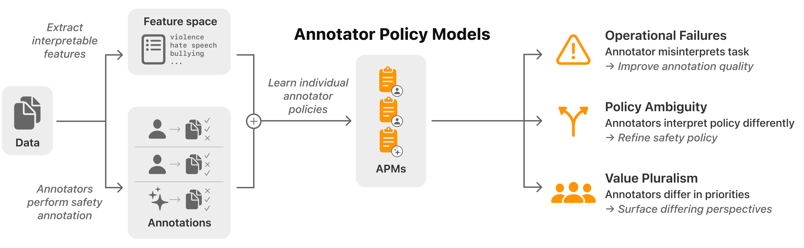

# Annotator Policy Models

We introduce Annotator Policy Models (APMs), interpretable models that learn annotators' internal safety policies from labeling behavior alone, making annotator reasoning visible and comparable without additional annotation effort.

Applying APMs to LLM and human annotations, we demonstrate two core applications: (1) surfacing policy ambiguity by revealing how annotators interpret safety instructions differently, and (2) surfacing value pluralism by uncovering systematic differences in safety priorities across demographic groups. Together, these capabilities support more targeted, transparent, and inclusive safety policy design.



This code accompanies the research paper:

**Understanding Annotator Safety Policy with Interpretability**\
[Alex Oesterling](https://alexoesterling.com/), [Donghao Ren](https://donghaoren.org), [Yannick Assogba](https://clome.info), [Dominik Moritz](https://www.domoritz.de), [Sunnie S. Y. Kim](https://sunniesuhyoung.github.io/), [Leon Gatys](https://www.linkedin.com/in/lgatys/), [Fred Hohman](https://fredhohman.com)\
FAccT, 2026.\
[Paper](https://arxiv.org/abs/2605.05329), [GitHub](https://github.com/apple/ml-annotator-policy-models)

## Getting Started

Requires Python 3.10+ and [uv](https://docs.astral.sh/uv/).

```bash
uv sync
```

See [`DOCUMENTATION.md`](DOCUMENTATION.md) for full setup instructions, data preparation, and how to run experiments.

## Repo Structure

* [`safe_dictionary_learning`](safe_dictionary_learning) — core library with decision function models (Non-Negative Logistic Regression, DNF) and text embedding/feature generation.
* [`experiments`](experiments) — code to replicate the experimental results from the paper.
* [`figures`](figures) — notebooks and data for generating paper figures.

## Contributing

When making contributions, refer to the [`CONTRIBUTING`](CONTRIBUTING.md) guidelines and read the [`CODE OF CONDUCT`](CODE_OF_CONDUCT.md).

## BibTeX

To cite our paper, please use:

```bibtex
@inproceedings{oesterling2026understanding,
    title={Understanding Annotator Safety Policy with Interpretability},
    author={Oesterling, Alex and Ren, Donghao and Assogba, Yannick and Moritz, Dominik and Kim, Sunnie S. Y. and Gatys, Leon and Hohman, Fred},
    booktitle={ACM Conference on Fairness, Accountability, and Transparency},
    year={2026},
    doi={10.1145/3805689.3806472}
}
```

## License

This code is released under the [`LICENSE`](LICENSE) terms.
